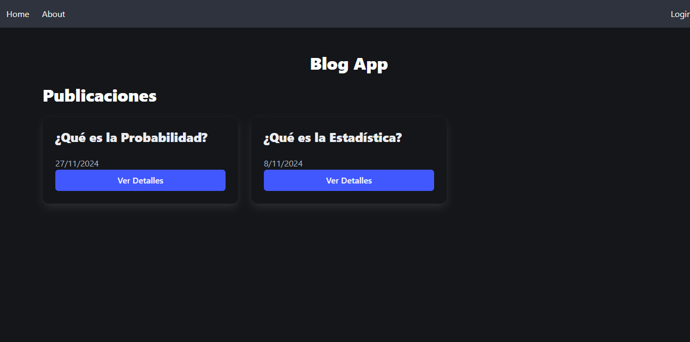
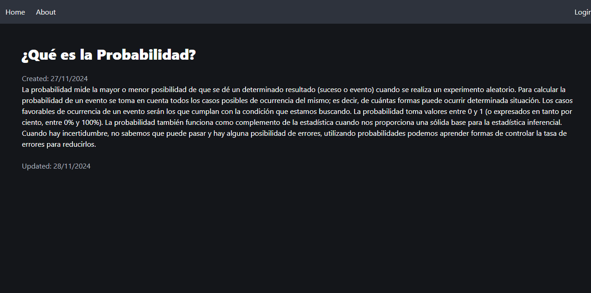
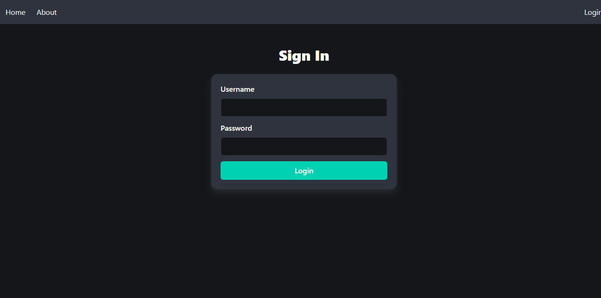
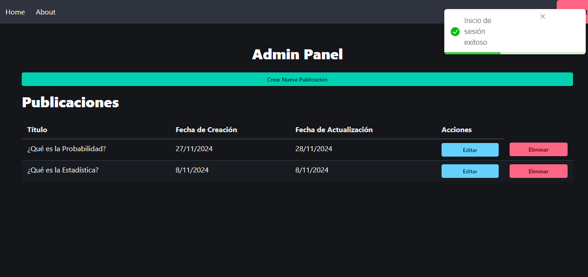
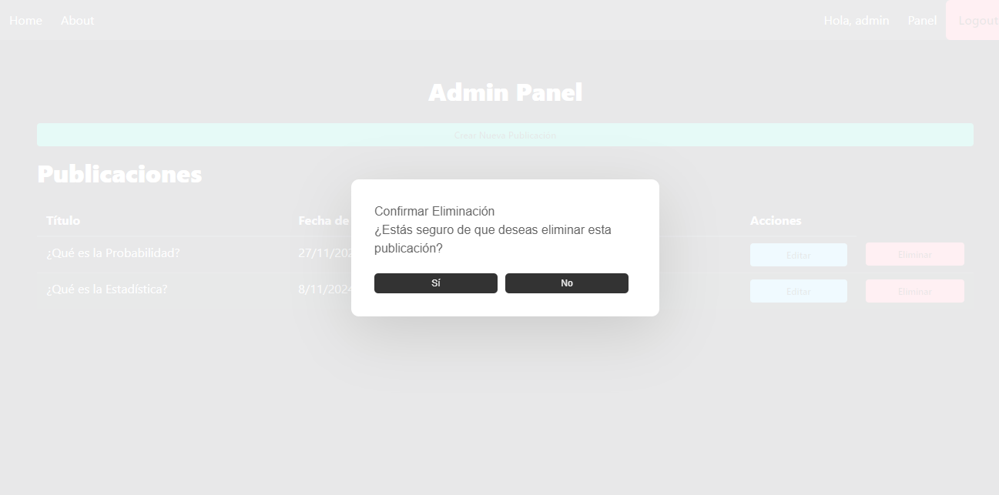

# Project Summary

**ReactJs Blog App Project**: Front End of the React Node MongoDB development stack. This project focuses on making a FrontEnd application of a Blog using ReactJs for the entire user interface, with three sections: Home Page, About and Post Administration Panel.

# Project Objectives

The project follows **two learning objectives** :

1. How to create components in ReactJs and reuse them on different pages such as editing and posts creation forms.
2. How to validate and authenticate users with Tokens using JWT to validate the editing and creation of posts.

# Requirements

Have knowledge of Javascript, React js,  Html and CSS

# Technical Requirements

- Node Js
- React Js
- Axios
- Jwt
- Bulma Css

# Preview

### Initial Main Screen 

### Post Details Screen

### Login (Validating User to Admin Panel)

### Admin Panel (Add, Edit and Erase Posts)

### Create New post Screen

### Editin Post Screen

### Erase Corfirmn window

***
