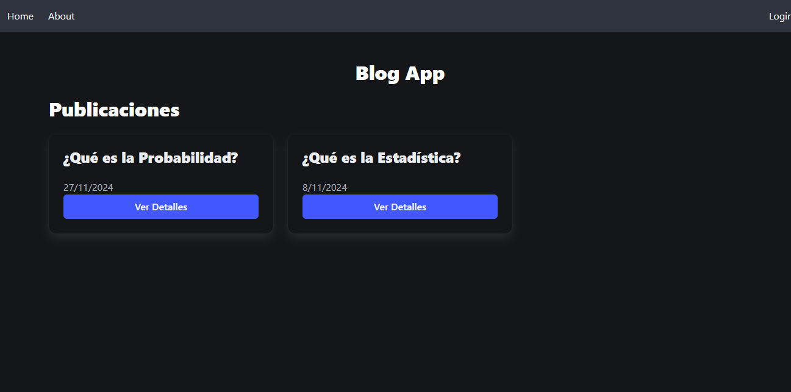
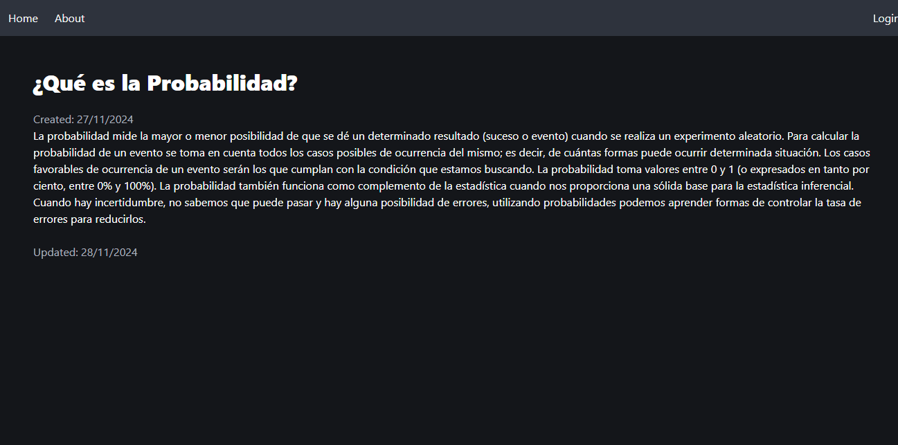
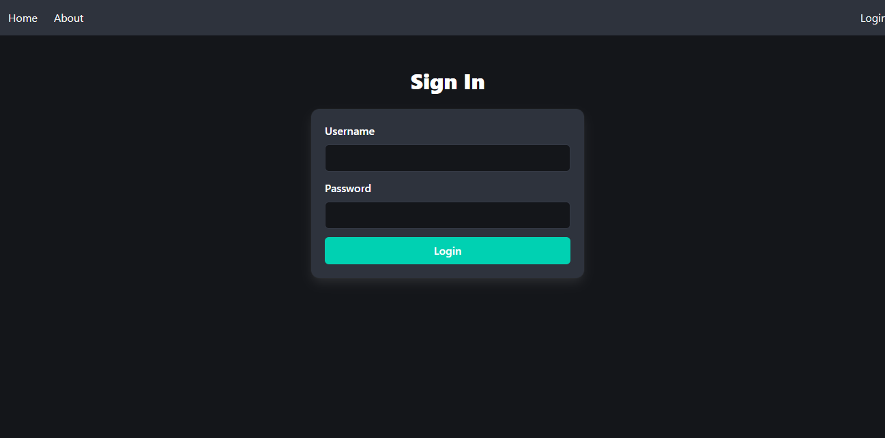
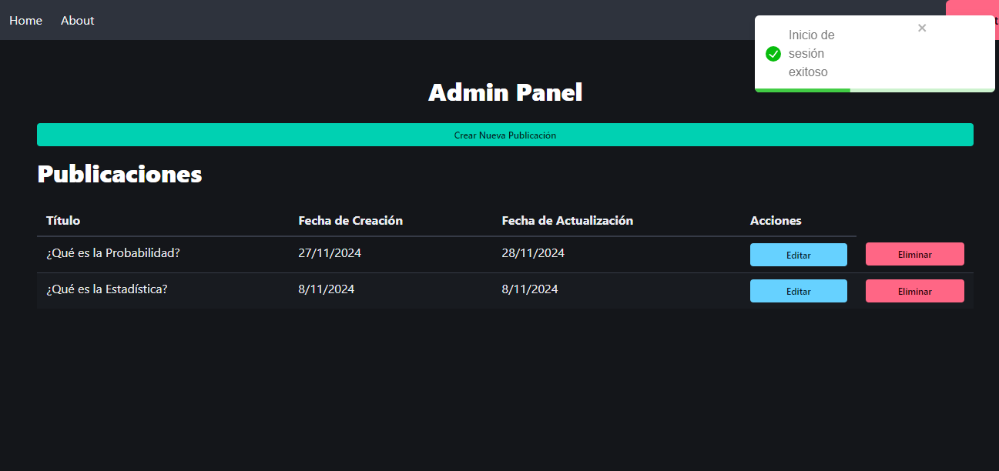
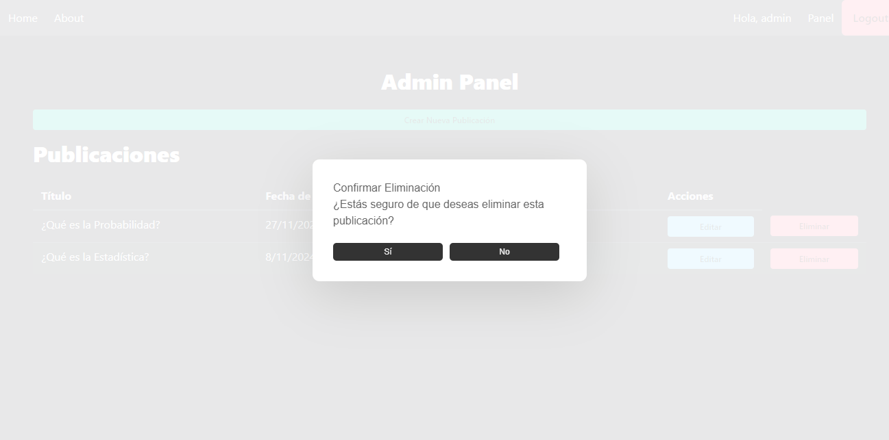

# ReactJS Blog Platform — Frontend Architecture

  
  
  
  

  

A modern, responsive frontend application built as part of a full-stack JavaScript ecosystem (React, Node.js, and MongoDB). This project serves as a dynamic blogging interface featuring an intuitive user experience and a secure administrative dashboard.

---

# 🚀 Key Features & Sections
- Home Page: Dynamic content feed showcasing published articles and public entries.
- About View: Informative section detailing the platform's vision and background.
Post Administration Panel: A secure, token-protected management interface empowering administrators to create, edit, and oversee content seamlessly.

# 🎯 Learning & Development Objectives
This personal project was engineered in 2024 to master core modern web development competencies:
Component-Driven Architecture: Designing modular, highly reusable React components (specifically shared form systems for both post creation and editing workflows).

Secure State & Authentication: Implementing stateless user authentication and session validation using JSON Web Tokens (JWT) to securely authorize administrative operations.

# 🛠️ Tech Stack & Requirements
- Frontend Library: React.js (Functional components, Hooks)
- API Communication: Axios
- Security: JSON Web Tokens (JWT)
- Styling Framework: Bulma CSS
- Runtime Environment: Node.js
Prerequisites for local development: Fundamental proficiency in JavaScript (ES6+), React.js, HTML5, and CSS3.

# Project Objectives

The project follows **two learning objectives** :
1. How to create components in ReactJs and reuse them on different pages such as editing and posts creation forms.
2. How to validate and authenticate users with Tokens using JWT to validate the editing and creation of posts.

# Preview

### Initial Main Screen 

### Post Details Screen

### Login (Validating User to Admin Panel)

### Admin Panel (Add, Edit and Erase Posts)

### Create New post Screen

### Editin Post Screen

### Erase Corfirmn window

---

👨‍💻 Author
Raul Ibáñez M.

Freelance Developer & Technical Lead

2024

***
